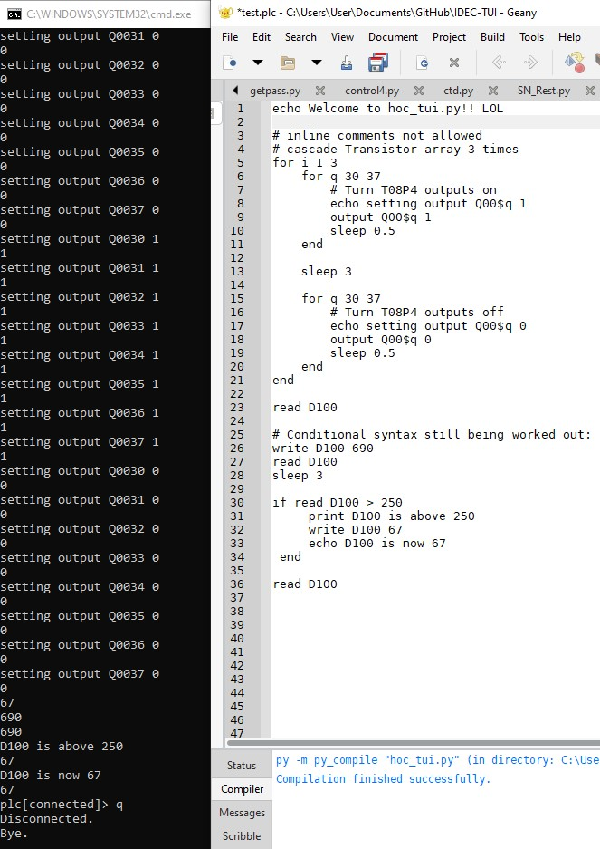
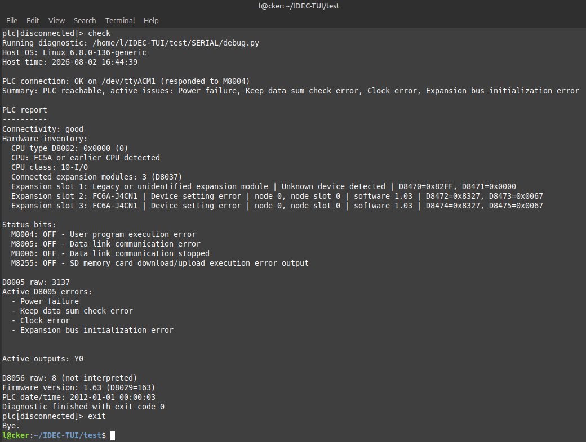

# IDEC-TUI

#Important Note: 
IDEC-TUI allows forcing Outputs.
What we do not do is release the force when IDEC-TUI Closes. 
so, you can force a state, exit the program, and the forced state 
will remain. To undo the forced IO you must call release_force or force_release
which will release all forced outputs. This is a design choice, and is as intended. 
But it is an important consideration. When you load IDEC-TUI again, if force was enabled, and never released, 
the PLC will still be in a forced IO state, until that state is deliberately released. 

<pre>
Added crude scripting features.
 - print / echo
 - if / else conditionals
 - # comments
 - for loops and nested for loops
 - call utils & helper functions from scripts
 - integrated PLC Emulator 
 
 
An interactive termnial for commanding your IDEC PLC. 

Terminal features would be nice right?
Well it is an interactive shell, and it could be improved.

        
 
<pre>

